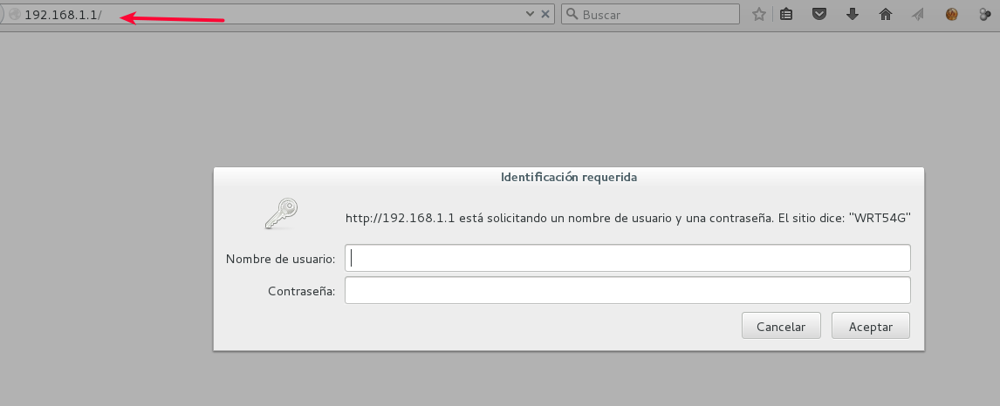
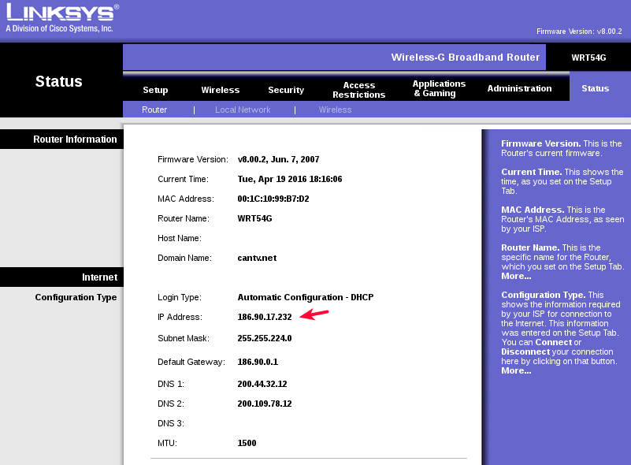
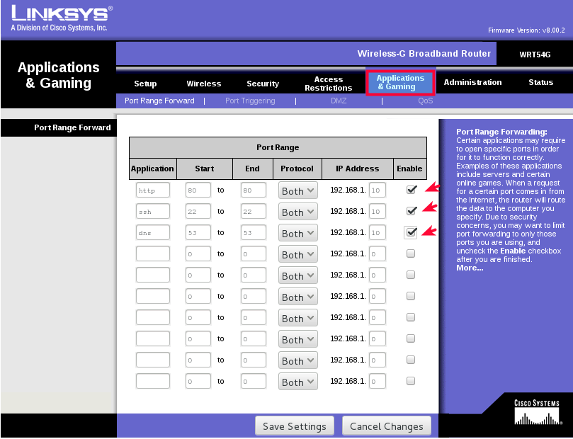

## Configurar router 

Utilizaremos un router **"LINKSYS Wireless-G Broadband Router"** para los laboratorios y enrutar las peticiones desde el internet hacia los servidores que asi lo requieran. La configuración de este router es exactamente igual que los demás router de la gama hogar, es decir, si se tiene claro que es lo que se quiere no importa que router tenga que configurar.

Debemos establecer conexión con la WIFI del router, luego en un navegador de internet colocamos la ip del router, si ya estableció conexión con dicha WIFI, puede obtener cual es la ip del router.
```
	$ netstat -r | awk '/default/ {print $2}'
	192.168.1.1
```

Colocamos el usuario y clave en este caso es usuario admin y clave admin.



En **status** en el tab **router** vamos a ver cual es la IP que nos esta entregando nuestro proveedor del ISP, porque esa es la IP que vamos a publicar en la NIC y en nuestro DNS Publico.



Luego en **Applications & Gaming** configuramos hacia cual ip y puerto vamos a desviar el trafico que provengan desde el internet hacia nuestros servidores de DNS, SMTP, POP3, IMAP4, etc. Ejemplo todas las peticiones que lleguen por la IP WAN que es la suministrada al router por nuestro ISP, específicamente por el puerto 80, serán desviadas y atendidas por la ip 192.168.1.10. Debemos tener un servidor con apache y con la IP 192.168.1.10.



Recuerde tomar nota de cual es la IP que esta en **status**
